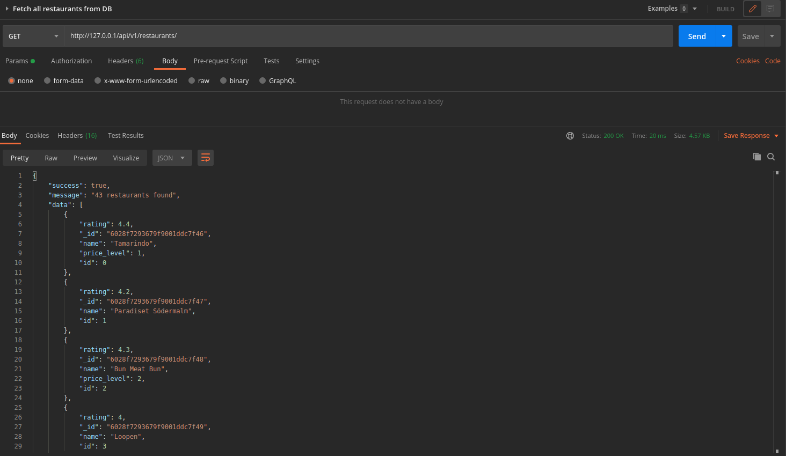
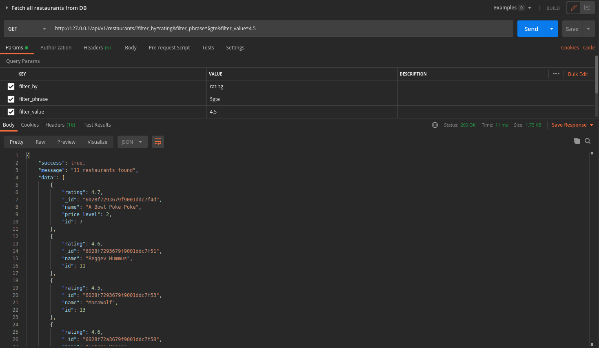
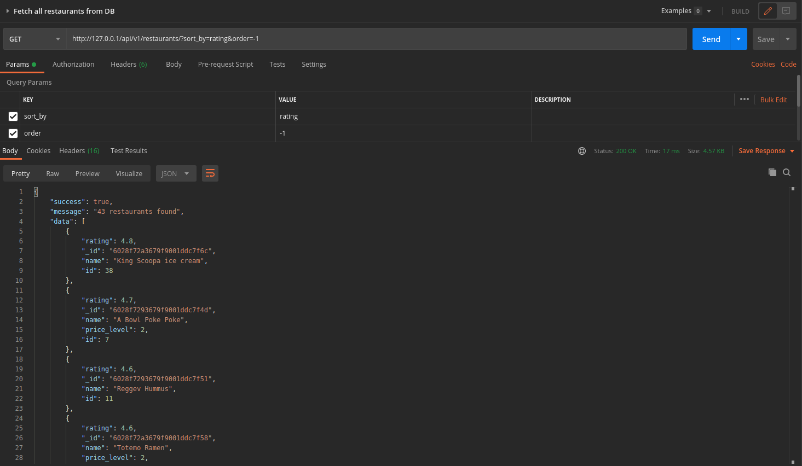
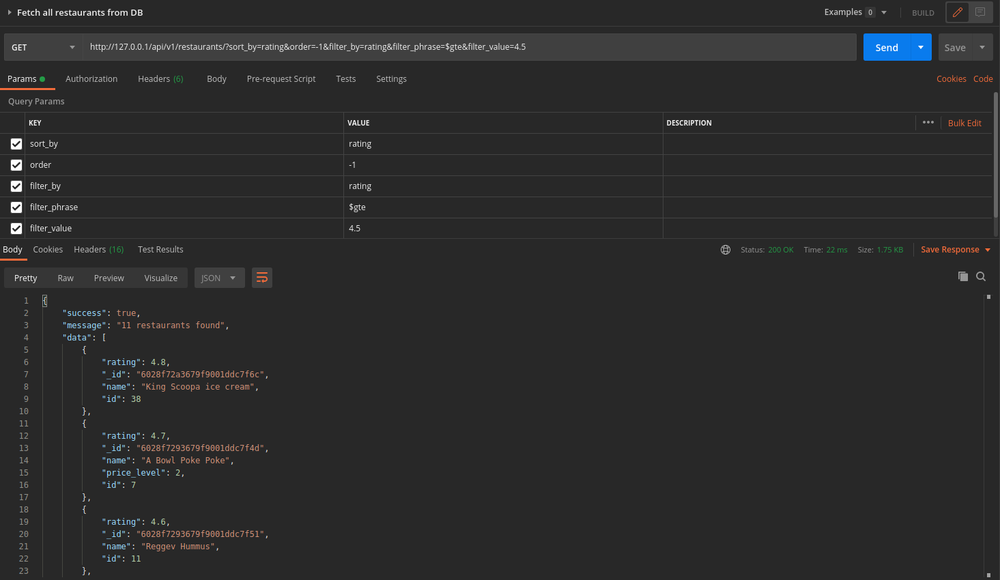
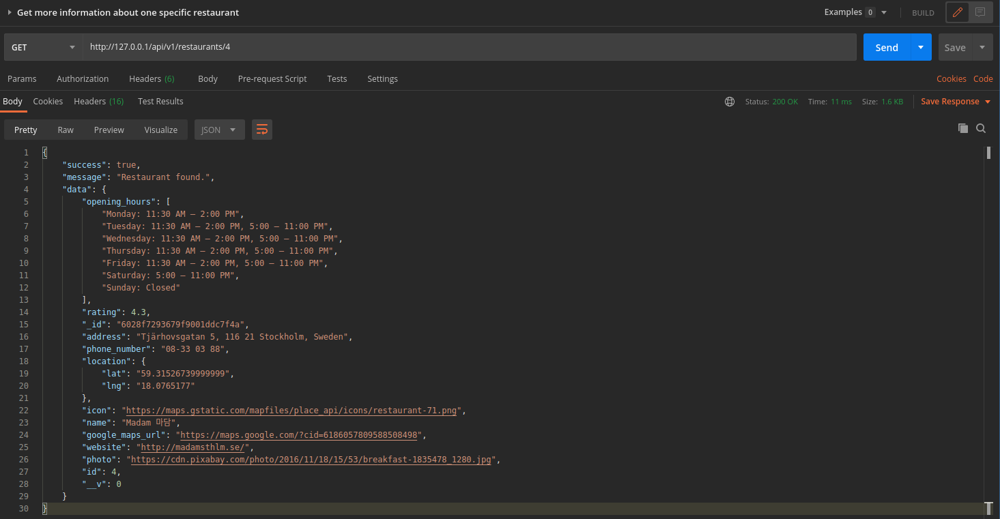
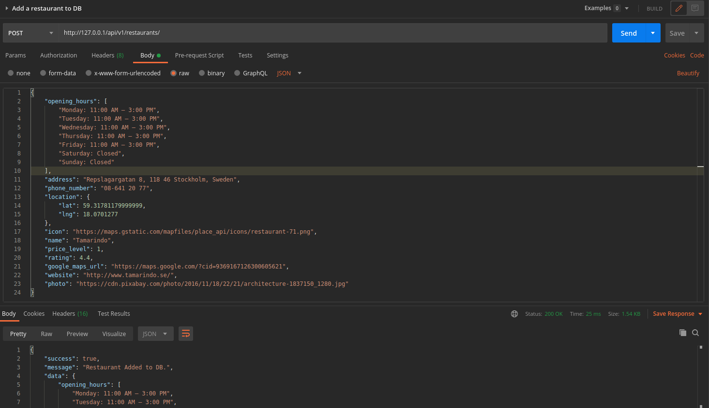
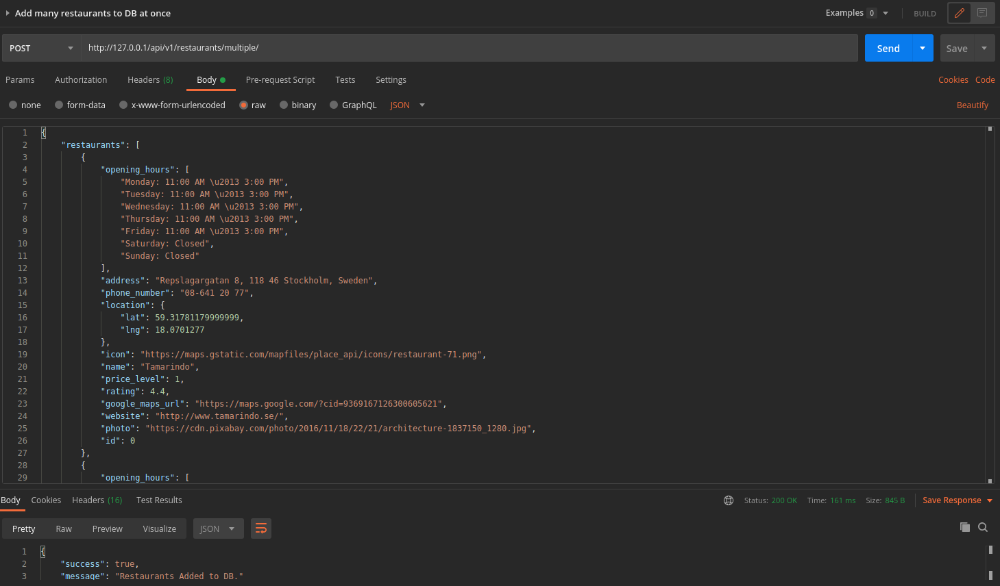
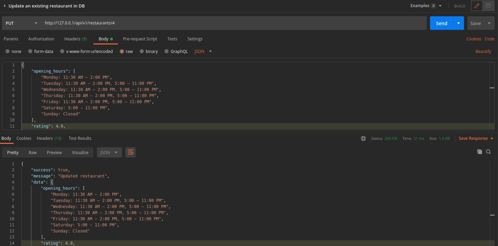
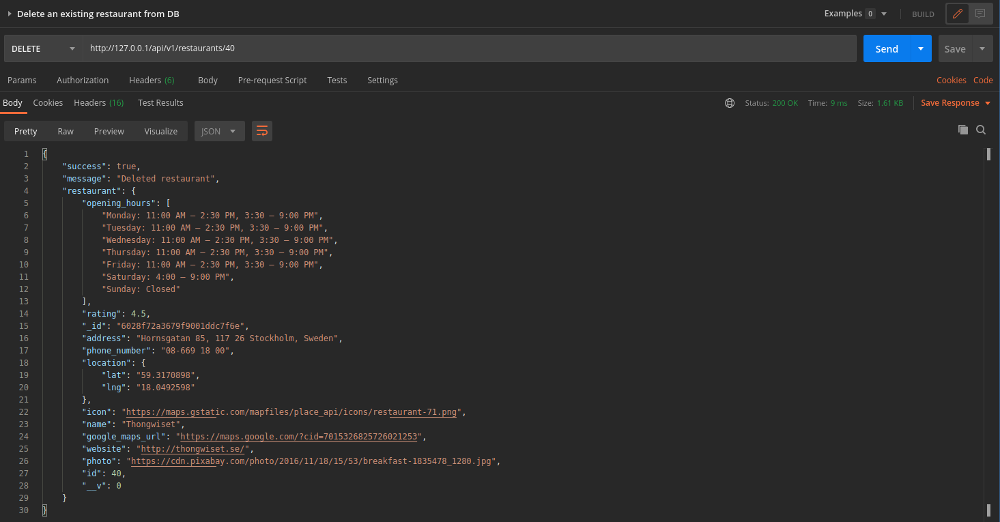
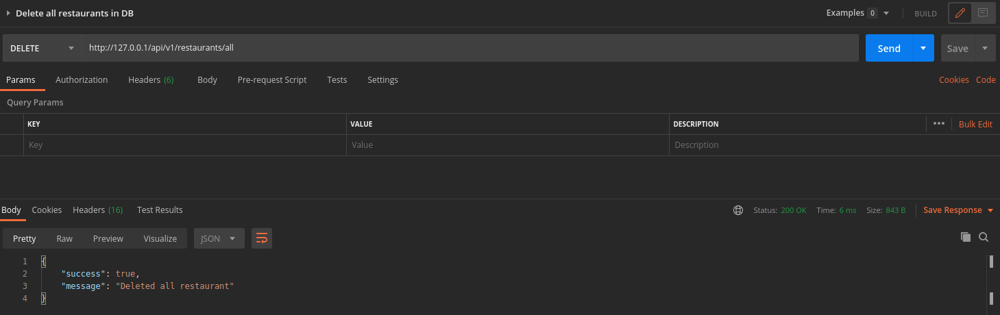

# NENT Group Tech Trainee 2021 - Coding Challenge

This build is a REST API implementation that can read and write into the provided db while providing endpoints to clients from which they will be able to perform basic CRUD (Create, Read, Update, Delete) operations on the database. The following challenges are addressed in this build:

### Mandatory
1. An endpoint that lets the client get a list of all restaurants
2. An endpoint that lets the client get more info on a single restaurant
3. An endpoint that accepts a POST request to add new restaurants to the DB
4. Functionality to delete restaurants from the DB through the API
5. Functionality to fetch a sorted list of restaurants based on relevant attributes
6. Functionality to fetch a filtered list of restaurants based on relevant attributes

### Optional
7. An endpoint that accepts a POST request to add multiple new restaurants at once to the DB
8. An endpoint that accepts a PUT request to update an existing restaurant in DB
9. An endpoint that accepts a DELETE request to delete all restaurants in the DB
10. Integration tests
11. Dockerize

  
## Directory Structure
<pre><code>|<b>assets/images</b>
|<b>middleware</b>
 --|<i>validators.js</i>
|<b>models</b>
 --|<i>restaurants.js</i>
|<b>routes</b>
 --|<i>restaurants.js</i>
|<b>tests</b>
 --|<i>restaurants.test.js</i>
|<b>.travis.yml</b>
|<b>docker-compose.testing.yml<b>
|<b>docker-compose.yml</b>
|<b>Dockerfile.production</b>
|<b>Dockerfile.testing</b>
|<b>package-lock.json</b>
|<b>package.json</b>
|<b>server.js</b>
</pre></code>

## Usage
### Docker version
1. Build the docker image<pre><code><b>npm run build</b></pre></code>

2. Run tests<pre><code><b>npm run test</b></pre></code>

3. Run production<pre><code><b>npm run build</b></pre></code>
---
### Non-Docker version
1. Set environment variables<pre><code><b>export NODE_ENV=dev export RUN=local</b></pre></code>
2. Install dependencies<pre><code><b>npm i</b></pre></code>
3. Run tests<pre><code><b>npm run test-local</b></pre></code>
4. Run production<pre><code><b>npm run start</b></pre></code>

## Endpoints
Request Type | URL | Description | Payload | Parameters |
|--|--|--|--|--|
|GET|/api/v1/restaurants|Fetch restaurants|None|Optional [example](#Filter-and-sorting-parameters)|
|GET|/api/v1/restaurants/:id|Fetch more information about a restaurant|None|"id" required|
|POST|/api/v1/restaurants|Add new restaurant|Required [example](#Add-new-restaurant)|None|
|POST|/api/v1/restaurants/multiple|Add multiple restaurants at once|Required [example](#Add-multiple-restaurants-at-once)|None|
|PUT|/api/v1/restaurants/:id|Update a restaurant|Required [example](#Update-a-restaurant)|"id" required|
|DELETE|/api/v1/restaurants/:id|Delete a restaurant|None|"id" required|
|DELETE|/api/v1/restaurants/all|Delete all restaurants|None|None|

## Payloads
### Add new restaurant
<pre><code><b>{
	"opening_hours":  [
	"Monday: 11:00 AM – 3:00 PM",
	"Tuesday: 11:00 AM – 3:00 PM",
	"Wednesday: 11:00 AM – 3:00 PM",
	"Thursday: 11:00 AM – 3:00 PM",
	"Friday: 11:00 AM – 3:00 PM",
	"Saturday: Closed",
	"Sunday: Closed"
	],
	"address":  "Repslagargatan 8, 118 46 Stockholm, Sweden",
	"phone_number":  "08-641 20 77",
	"location":  {
		"lat":  59.31781179999999,
		"lng":  18.0701277
	},
	"icon":  "https://maps.gstatic.com/mapfiles/place_api/icons/restaurant-71.png",
	"name":  "Tamarindo",
	"price_level":  1,
	"rating":  4.4,
	"google_maps_url":  "https://maps.google.com/?cid=9369167126300605621",
	"website":  "http://www.tamarindo.se/",
	"photo":  "https://cdn.pixabay.com/photo/2016/11/18/22/21/architecture-1837150_1280.jpg"
}</b>
</code></pre>

### Add multiple restaurants at once 
<pre><code><b>{
	restaurants: [
		{
			"opening_hours":  [
			"Monday: 11:00 AM – 3:00 PM",
			"Tuesday: 11:00 AM – 3:00 PM",
			"Wednesday: 11:00 AM – 3:00 PM",
			"Thursday: 11:00 AM – 3:00 PM",
			"Friday: 11:00 AM – 3:00 PM",
			"Saturday: Closed",
			"Sunday: Closed"
			],
			"address":  "Repslagargatan 8, 118 46 Stockholm, Sweden",
			"phone_number":  "08-641 20 77",
			"location":  {
				"lat":  59.31781179999999,
				"lng":  18.0701277
			},
			"icon":  "https://maps.gstatic.com/mapfiles/place_api/icons/restaurant-71.png",
			"name":  "Tamarindo",
			"price_level":  1,
			"rating":  4.4,
			"google_maps_url":  "https://maps.google.com/?cid=9369167126300605621",
			"website":  "http://www.tamarindo.se/",
			"photo":  "https://cdn.pixabay.com/photo/2016/11/18/22/21/architecture-1837150_1280.jpg"
		},
		.
		.
		.
	]
}</b>
</code></pre>

### Update a restaurant
Same as [1](#Add-new-restaurant)

## Filter and sorting parameters 
### Filter parameters

| Properties | Options  | Description |
|--|--|--|
|filter_by|rating, price_level|Filter the restaurants based on their rating or price_level|
|filter_phrase|$lt, $lte, $gt, $gte|Choose comparison type with "\$lt" for less than, "\$lte" for less than or equal, "\$gt" for greater than and "\$gte" for greater than or equal|
|filter_value|Numeric values|Value to be compared against|

### Sorting parameters
| Properties | Options  | Description |
|--|--|--|
|sort_by|id, name, rating, price_level|Sort the restaurants based on their id, name, rating or price_level|
|order|-1 or 1|Choose order of arrangement with -1 for descending order and 1 for ascending order|

## Examples

1. Fetch all restaurants - **GET /api/v1/restaurants**

  

  

- Filtering restaurants

  

  

- Sorting restaurants

  

  

- Using filter and sort together

  

  

---

2.  **Get more information about one specific restaurant** - **GET /api/v1/restaurants/<restaurant_id>**

---

3. Add a new restaurant - **POST /api/v1/restaurants**

---

4. Add many restaurants at a once - **POST /api/v1/restaurants/multiple**

---

5. Update an exisiting restaurant - **PUT /api/v1/restaurants/<restaurant_id>**

---

6. Delete an exisiting restaurant - **DELETE /api/v1/restaurants/<restaurant_id>**

---

7. Delete all restaurants - **DELETE /api/v1/restaurants/all**

---

## Design choices

---

## Improvements and bugs

---

## Afterthoughts

---

**Author :** Saipranav Koyyada (saipranav_29@outlook.com)
https://www.linkedin.com/in/saipranavkoyyada/
Please feel free to contact for any queries or feedback.
