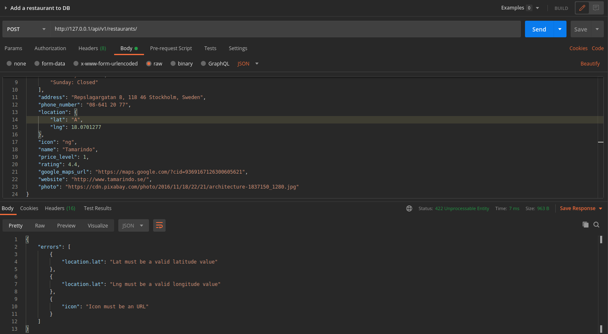
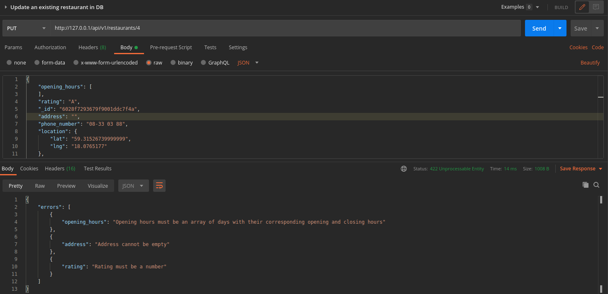
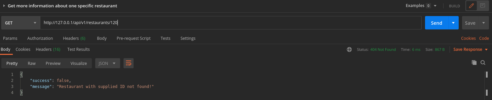
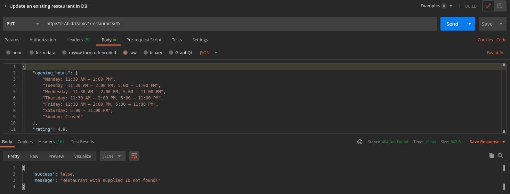
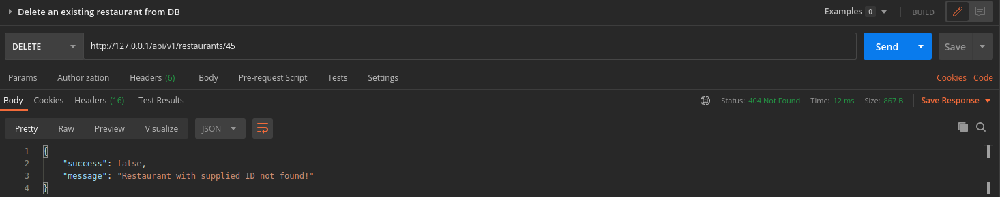
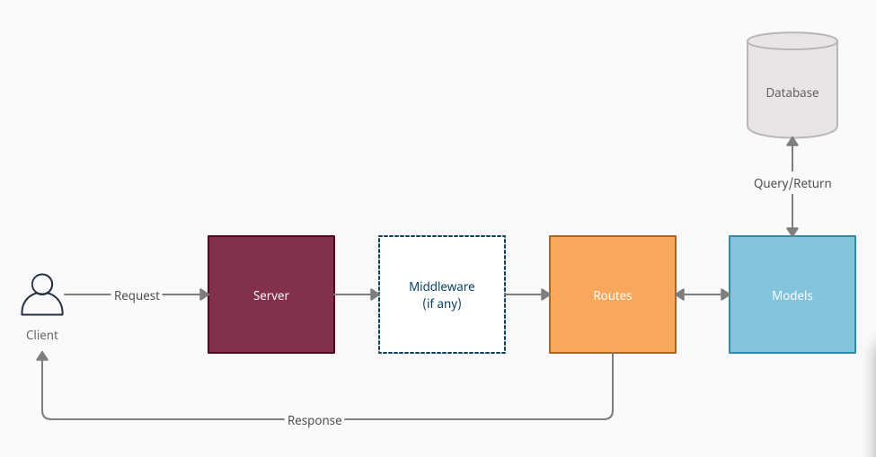

# NENT Group Tech Trainee 2021 - Coding Challenge

This build is a REST API implementation that can read and write into the provided db while providing endpoints to clients from which they will be able to perform basic CRUD (Create, Read, Update, Delete) operations on the database. The following challenges are addressed in this build:

### Mandatory
1. An endpoint that lets the client get a list of all restaurants
2. An endpoint that lets the client get more info on a single restaurant
3. An endpoint that accepts a POST request to add new restaurants to the DB
4. Functionality to delete restaurants from the DB through the API
5. Functionality to fetch a sorted list of restaurants based on relevant attributes
6. Functionality to fetch a filtered list of restaurants based on relevant attributes

### Optional
7. An endpoint that accepts a POST request to add multiple new restaurants at once to the DB
8. An endpoint that accepts a PUT request to update an existing restaurant in DB
9. An endpoint that accepts a DELETE request to delete all restaurants in the DB
10. Integration tests
11. Dockerize

## Directory Structure
<pre><code>|<b>assets/images</b>
|<b>middleware</b>
 --|<i>validators.js</i>
|<b>models</b>
 --|<i>restaurants.js</i>
|<b>routes</b>
 --|<i>restaurants.js</i>
|<b>tests</b>
 --|<i>restaurants.test.js</i>
|<b>.travis.yml</b>
|<b>docker-compose.testing.yml</b>
|<b>docker-compose.yml</b>
|<b>Dockerfile.production</b>
|<b>Dockerfile.testing</b>
|<b>package-lock.json</b>
|<b>package.json</b>
|<b>server.js</b>
</code></pre>

- middleware/validators.js: Responsible for middleware function used for validating incoming request payload.
- models/restaurants.js: Defines the restaurant schema and decides which database to connect based on execution environment.
- routes/restaurants.js: Business logic for the REST API. It consists of different URLs with their respective functionality implementation accessible by the client through https requests.
- server.js: Entry point for the program and handles all the incoming requests.
- .travis.yml: Build automation script
- docker-compose.yml: Docker service compose script for production build.
- docker-compose.testing.yml: Docker service compose script for test build.
- Dockerfile.production: Steps to build production image.
- Dockerfile.testing: Steps to build test image.
- package.json/package-lock.json: Dependency and run script managers.

## Usage
The program can be build using two methods. First method requires Docker(https://www.docker.com/). 
### Docker method (tested on Docker version 19.03.8, build afacb8b7f0)
1. **Build the docker image**<pre><code><b>npm run build</b></code></pre>This will create the docker images for production build.

2. **Run tests**<pre><code><b>npm run test</b></code></pre>This will create the docker image for test build and compose it with required services to start the container. The test build will perform the tests and exit execution. It uses a different test database for testing.

3. **Run production**<pre><code><b>npm run build</b></code></pre>This will run the production build by composing a container with required services. It will start the server to accept requests. The server can be accessed on localhost(127.0.0.1).
---
Alternatively, if you prefer not to install docker, you can use this approach to run the program
### Non-Docker method
1. **Set environment variables**<pre><code><b>export NODE_ENV=dev 
export RUN=local</b></code></pre>This will make sure that the execution is local and thus will rely on a local server of mongo.

2. **Spin a local server of Mongo**<pre><code><b>mongod</b></code></pre>This will create a local server of mongo. It must be kept alive and accessible on localhost(127.0.0.1) over port 27017 by default.

3. **Install dependencies**<pre><code><b>npm i</b></code></pre>This will install all neccessary pacakges to run the program. Each package version is available in package.json

4. **Run tests**<pre><code><b>npm run test-local</b></code></pre>This will run tests. It uses a different local database for testing.

5. **Run production**<pre><code><b>npm run start</b></code></pre>This will open the server for accepting incoming requests and can be accessed on localhost(127.0.0.1) over port 3000 unless an alternative port is set as environment variable. 

## Endpoints
Request Type | URL | Description | Payload | Parameters |
|--|--|--|--|--|
|GET|/api/v1/restaurants|Fetch restaurants|None|Optional [example](#Filter-and-sorting-parameters)|
|GET|/api/v1/restaurants/:id|Fetch more information about a restaurant|None|"id" required|
|POST|/api/v1/restaurants|Add new restaurant|Required [example](#Add-new-restaurant)|None|
|POST|/api/v1/restaurants/multiple|Add multiple restaurants at once|Required [example](#Add-multiple-restaurants-at-once)|None|
|PUT|/api/v1/restaurants/:id|Update a restaurant|Required [example](#Update-a-restaurant)|"id" required|
|DELETE|/api/v1/restaurants/:id|Delete a restaurant|None|"id" required|
|DELETE|/api/v1/restaurants/all|Delete all restaurants|None|None|

## Payloads
These snippets are available as json [here](./example_payloads)
### Add new restaurant
<pre><code><b>{
	"opening_hours":  [
	"Monday: 11:00 AM – 3:00 PM",
	"Tuesday: 11:00 AM – 3:00 PM",
	"Wednesday: 11:00 AM – 3:00 PM",
	"Thursday: 11:00 AM – 3:00 PM",
	"Friday: 11:00 AM – 3:00 PM",
	"Saturday: Closed",
	"Sunday: Closed"
	],
	"address":  "Repslagargatan 8, 118 46 Stockholm, Sweden",
	"phone_number":  "08-641 20 77",
	"location":  {
		"lat":  59.31781179999999,
		"lng":  18.0701277
	},
	"icon":  "https://maps.gstatic.com/mapfiles/place_api/icons/restaurant-71.png",
	"name":  "Tamarindo",
	"price_level":  1,
	"rating":  4.4,
	"google_maps_url":  "https://maps.google.com/?cid=9369167126300605621",
	"website":  "http://www.tamarindo.se/",
	"photo":  "https://cdn.pixabay.com/photo/2016/11/18/22/21/architecture-1837150_1280.jpg"
}</b>
</code></pre>

### Add multiple restaurants at once 
<pre><code><b>{
	restaurants: [
		{
			"opening_hours":  [
			"Monday: 11:00 AM – 3:00 PM",
			"Tuesday: 11:00 AM – 3:00 PM",
			"Wednesday: 11:00 AM – 3:00 PM",
			"Thursday: 11:00 AM – 3:00 PM",
			"Friday: 11:00 AM – 3:00 PM",
			"Saturday: Closed",
			"Sunday: Closed"
			],
			"address":  "Repslagargatan 8, 118 46 Stockholm, Sweden",
			"phone_number":  "08-641 20 77",
			"location":  {
				"lat":  59.31781179999999,
				"lng":  18.0701277
			},
			"icon":  "https://maps.gstatic.com/mapfiles/place_api/icons/restaurant-71.png",
			"name":  "Tamarindo",
			"price_level":  1,
			"rating":  4.4,
			"google_maps_url":  "https://maps.google.com/?cid=9369167126300605621",
			"website":  "http://www.tamarindo.se/",
			"photo":  "https://cdn.pixabay.com/photo/2016/11/18/22/21/architecture-1837150_1280.jpg"
		},
		.
		.
		.
	]
}</b>
</code></pre>

### Update a restaurant
Same as [1](#Add-new-restaurant)

## Filter and sorting parameters 
Filter and sorting parameters are query parameters available only for GET /api/v1/restaurants. It helps client fetch restaurant information based on sorting and filter properties. They can be used individually or combined. Invalid query parameter requests resulting from incomplete property declaration or invalid property value will return all the restaurants in the database sorted by their id values in ascending order. 

### Filter parameters
| Properties | Options  | Description |
|--|--|--|
|filter_by|rating, price_level|Filter the restaurants based on their rating or price_level|
|filter_phrase|$lt, $lte, $gt, $gte|Choose comparison type with "\$lt" for less than, "\$lte" for less than or equal, "\$gt" for greater than and "\$gte" for greater than or equal|
|filter_value|Numeric values|Value to be compared against|

### Sorting parameters
| Properties | Options  | Description |
|--|--|--|
|sort_by|id, name, rating, price_level|Sort the restaurants based on their id, name, rating or price_level|
|order|-1 or 1|Choose order of arrangement with -1 for descending order and 1 for ascending order|

## Examples
### - Fetch all restaurants

### - Filtering restaurants

### - Sorting restaurants

### - Using filter and sort together

---

### - Get more information about one specific restaurant

---

### - Add a new restaurant

---

### - Add many restaurants at a once

---

### - Update an exisiting restaurant

---

### - Delete an exisiting restaurant

---

### - Delete all restaurants

---

### - Add/Update payload validation

---

### - Invalid request response

## Design choices
The Project adopts a Model-View-Controller approach. The database is isolated and accessible only via models. restaurants module. Routes act as a controller managing the program flow and delivering functionality by communicating with models.restaurants. Some routes use middleware.validators to sanitize incoming request payload. Finally, the server acts as the entry point for the program. Such a code structure will create clear boundaries between the functionalities of each module thus improving the overall project cohesion. Also, it will be easier to manage and maintain the program this way.

## Improvements and bugs
1. **Improvement 1:** Protect data modification routes with authentication to authorize only relevant users to manage and implement data changes. This improvement was ignored to limit the scope of code challenge and allow easier access for the evaluators. 
2. **Improvement 2:** There is no payload validation for multiple restaurant entries at once. Express-validator offers wildcards to loop through an array and provides validation but this discovery was made very late into the project and I did not want to break the code right before the submission deadline. Also, it is possible to have only one route to enter 1 or many restaurants at a time. Since I did not have validation for allowing many restaurants at once, I stuck with creating two different routes. 
3. **Improvement 3:** More test cases and response assertion should be made to confirm the response. Currently, the test cases only assert the response status which is good but would be better if it can also check the response and compare it with the expected one. It is possible to do it with tape and supertest packages. I did not personally feel that it was necessary because the project scope is very limited and does not have a lot of different responses or execution paths. Also, I did not want to cram the tests and make them unreadable. Therefore I skipped this. 

## Afterthoughts
The challenge puts your thoughts and experience to the test. On paper, the problem sounds simple. But despite working with REST APIs and having previous hands-on experience, many uncertainties arise during implementation. For me, designing and implementing the solution was not a challenge, but to test and dockerize it took some serious time. In the process, I also found bugs that I fixed. I never automated my tests on REST APIs in the past. Also, I had only limited understanding and knowledge of docker that I acquired during my internships. But working with this challenge, I certainly improved and expanded my knowledge of these technologies. I feel the application I have written meets standard coding practices.  

---

**Author :** Saipranav Koyyada (saipranav_29@outlook.com)

https://www.linkedin.com/in/saipranavkoyyada/

Please feel free to contact for any queries or feedback.
