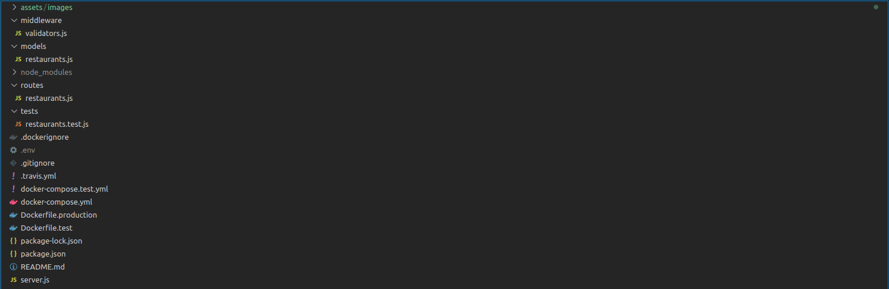

# NENT Group Tech Trainee 2021 - Coding Challenge
[](https://travis-ci.com/SaipranavK/NE-rest-back)

The following challenges are addressed in this build:

### Mandatory
1. An endpoint that lets the client get a list of all restaurants
2. An endpoint that lets the client get more info on a single restaurant
3. An endpoint that accepts a POST request to add new restaurants to the DB
4. Functionality to delete restaurants from the DB through the API
5. Functionality to fetch a sorted list of restaurants based on relevant attributes
6. Functionality to fetch a filtered list of restaurants based on relevant attributes

### Optional
7. An endpoint that accepts a POST request to add multiple new restaurants at once to the DB
8. An endpoint that accepts a POST request to update an exisiting restaurant in DB
9. An endpoint that accepts a DELETE request to delete all restaurants in the DB
10. Integration tests 
11. Dockerize


---

## Usage
### Docker version
1. Build the docker image
```
npm run build
```
2. Run tests
```
npm run test
```
3. Run production
```
npm run production
```
### Non-Docker version 
1. Set environment vairables
```
$export NODE_ENV=dev
$export RUN=local
```
2. Install dependencies
```
npm i
```
3. Run tests
```
npm run test-local
```
4. Run production
```
npm start
```

---
## Endpoints
1. Fetch all restaunrants ==> **GET /api/v1/restaurants** 


- Filtering restaurants


- Sorting restaurants


- Using filter and sort together


---
2. Get more information about one specific restaurant ==> **GET /api/v1/restaurants/<restaurant_id>**

---
3. Add a new restaurant ==> **POST /api/v1/restaurants**

---
4. Add many restaurants at a once ==> **POST /api/v1/restaurants/multiple**

---
5. Update an exisiting restaurant ==> **PUT /api/v1/restaurants/<restaurant_id>**

---
6. Delete an exisiting restaurant ==> **DELETE /api/v1/restaurants/<restaurant_id>**

---
7. Delete all restaurants ==> **DELETE /api/v1/restaurants/all**

---
## Design choices
---
## Improvements and bugs
---
## Afterthoughts 
---
**Author :** Saipranav Koyyada (saipranav_29@outlook.com)

https://www.linkedin.com/in/saipranavkoyyada/ 

Please feel free to contact for any queries or feedback.


